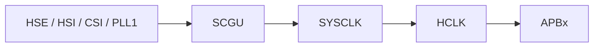
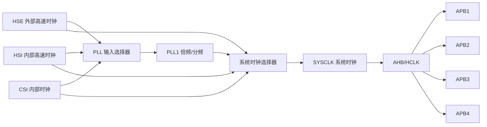

# RCC

## RCC 是什么？

RCC 是 **Reset and Clock Control**，即复位和时钟控制模块。

它主要负责两件事：

1. 管理芯片内部和外部的时钟源；
2. 管理系统、总线、外设的复位和时钟使能。

在 STM32 中，大部分外设在使用前都需要先打开对应的 RCC 时钟。例如使用 GPIOA 前，需要先使能 GPIOA 的时钟。

```c
__HAL_RCC_GPIOA_CLK_ENABLE();
```

如果没有打开外设时钟，即使程序访问外设寄存器，外设通常也不会正常工作。

---

## RCC 的主要作用

RCC 的作用可以概括为：

| 功能     | 说明                                       |
| ------ | ---------------------------------------- |
| 时钟源管理  | 打开或关闭 HSI、HSE、LSI、LSE、CSI 等振荡器           |
| PLL 配置 | 通过 PLL 对输入时钟进行倍频和分频，产生更高频率的时钟            |
| 系统时钟选择 | 选择 SYSCLK 来自 HSI、HSE、CSI 或 PLL           |
| 总线分频   | 配置 AHB、APB1、APB2、APB3、APB4 等总线频率         |
| 外设时钟选择 | 给 USART、SPI、SDMMC、ADC 等外设选择 kernel clock |
| 外设时钟使能 | 打开 GPIO、USART、TIM、DMA 等外设的总线时钟           |
| 复位控制   | 控制系统复位、外设复位、看门狗复位等                       |

---

## STM32H7 常见时钟源


STM32H7 内部有多个时钟源。它们可以同时打开，但某个具体的时钟选择器通常只能选择其中一路作为输入。

| 名称    | 类型           |            常见频率 | 典型用途               |
| ----- | ------------ | --------------: | ------------------ |
| HSI   | 内部高速 RC 时钟   | 64 MHz 左右，具体看型号 | 系统启动、备用系统时钟、部分外设   |
| HSE   | 外部高速时钟       | 常见 8 MHz、25 MHz | 系统主时钟、PLL 输入源      |
| CSI   | 内部时钟源        |  4 MHz 左右，具体看型号 | 低功耗、PLL 输入源、系统备用时钟 |
| LSI   | 内部低速 RC 时钟   |        约 32 kHz | IWDG、RTC 备用时钟      |
| LSE   | 外部低速晶振       |      32.768 kHz | RTC、低功耗实时时钟        |
| HSI48 | 内部 48 MHz 时钟 |          48 MHz | USB、RNG、CRS 等      |

注意：

> 振荡器可以同时打开多个，但是在某一个 MUX 选择点上，只能选择一路继续往后输出。

例如：

```text
HSE、HSI、CSI 可以同时打开
但是 PLL 输入源只能选择 HSE / HSI / CSI 中的一个
```
CSS 是时钟安全系统，它用于检测外部时钟是否失效。
| 名称 | 作用 |
| --- | ---  | 
|  HSE_CSS  |  检测系统主时钟或者PLL输入是否异常  |
|  LSE_CSS  |  检测RTC(实时时钟)是否异常  |

外设的时钟有两种来源：**总线时钟(Bus Clock)**和**外设核时钟(Periph Kernel Clock)**
总线时钟来自于System Clock Generation Unit(SCGU)，它负责生成系统时钟。总线时钟的作用是可以使CPU读取外设寄存器

外设核时钟的来源可以不是SYSCLK，来自PKSU(Peripheral Kernel clock Selection Unit)，它负责外设具体工作的时钟。


---

## RCC 时钟路径的基本结构

可以把 RCC 时钟树理解成下面这种结构：



核心过程是：

```text
时钟源 → MUX 选择 → PLL 倍频/分频 → SYSCLK → AHB → APB → 外设
```

---

## PLL 的作用

PLL 是 Phase Locked Loop，锁相环。

在 RCC 中，PLL 主要用于把一个较低频率的时钟变换为更高或更合适的频率。

典型结构：

```text
输入时钟 → PLLM 分频 → PLLN 倍频 → PLLP/PLLQ/PLLR 分频输出
```

对于 STM32H7 的 PLL1，可以理解为：

```text
PLL 输入频率 = 输入时钟 / PLLM
VCO 频率 = PLL 输入频率 × PLLN
PLL1P 输出 = VCO / PLLP
PLL1Q 输出 = VCO / PLLQ
PLL1R 输出 = VCO / PLLR
```

其中：

| 参数   | 作用                |
| ---- | ----------------- |
| PLLM | PLL 输入预分频         |
| PLLN | VCO 倍频系数          |
| PLLP | P 输出分频，常用于 SYSCLK |
| PLLQ | Q 输出分频，常用于部分外设    |
| PLLR | R 输出分频，常用于部分外设    |

---

## 外设时钟和总线时钟

STM32H7 中要注意区分：

```text
外设总线时钟 bus clock
外设内核时钟 kernel clock
```

### 外设总线时钟

外设总线时钟用于让 CPU 访问外设寄存器。

例如：

```c
__HAL_RCC_USART1_CLK_ENABLE();
```

这类代码就是打开外设挂载总线上的时钟。

如果没有打开总线时钟，CPU 访问外设寄存器通常不会正常工作。

---

### 外设内核时钟

外设内核时钟是外设真正工作用的时钟。

例如 USART 的波特率产生、SDMMC 的数据传输、ADC 的采样等，都需要外设自己的 kernel clock。

有些外设的 kernel clock 可以从多个来源中选择，例如：

```text
PCLK
PLL1Q
PLL2
PLL3
HSI
CSI
LSE
```

具体选择哪个，要看外设类型和芯片参考手册。

---

## RTC 时钟选择

RTC 通常使用低速时钟。

常见选择：

| RTC 时钟源 | 优点         | 缺点                 |
| ------- | ---------- | ------------------ |
| LSE     | 精度高，适合长期计时 | 需要外部 32.768 kHz 晶振 |
| LSI     | 不需要外部晶振    | 精度较差               |
| HSE 分频  | 精度取决于 HSE  | 功耗较高，不适合长期低功耗 RTC  |

一般推荐：

```text
LSE 32.768 kHz → RTC
```

---

## CSS 时钟安全系统

CSS 是 Clock Security System。

它可以检测外部时钟是否失效。

常见有：

```text
HSE CSS
LSE CSS
```

如果外部晶振异常停止，CSS 可以产生中断或故障事件。

用途包括：

1. 保护系统；
2. 触发异常处理；
3. 在电机控制等场景中触发定时器刹车保护。

---

## MCO 时钟输出

MCO 是 Microcontroller Clock Output。

它可以把 MCU 内部时钟输出到外部引脚。

常见用途：

1. 用示波器观察 HSE、HSI、SYSCLK、PLLCLK 是否正常；
2. 给外部芯片提供参考时钟；
3. 调试时钟配置。

例如可以输出：

```text
HSE
HSI
LSE
PLLCLK
SYSCLK
```

---
# AHB/APB Clock Resource

## 总体时钟主线

STM32H743 的 CPU、AHB、APB 时钟大致由 `sys_ck` 逐级分频得到：

```text
sys_ck
  ↓
D1CPRE
  ↓
sys_d1cpre_ck
  ↓
HPRE
  ↓
HCLK / AHB clocks
  ↓
APBx prescaler
  ↓
PCLKx / APB clocks
```

最重要的关系：

```text
D1CPRE：控制 CPU / D1 前级时钟
HPRE：控制 AHB / HCLK 总线时钟
D1PPRE / D2PPRE1 / D2PPRE2 / D3PPRE：控制各 APB 总线时钟
```

---

## D1CPRE 是什么？

`D1CPRE` 是 `sys_ck` 后面的第一级分频器。

它生成：

```text
sys_d1cpre_ck
```

主要影响 CPU 相关时钟。

在 HAL 中通常对应：

```c
RCC_ClkInitStruct.SYSCLKDivider
```

例如：

```c
RCC_ClkInitStruct.SYSCLKDivider = RCC_SYSCLK_DIV1;
```

表示 `sys_ck` 不分频送往后级。

---

## HPRE 是什么？

`HPRE` 是 AHB prescaler，也就是 AHB 总线分频器。

在 HAL 中对应：

```c
RCC_ClkInitStruct.AHBCLKDivider
```

例如：

```c
RCC_ClkInitStruct.AHBCLKDivider = RCC_HCLK_DIV2;
```

表示：

```text
HCLK = sys_d1cpre_ck / 2
```

注意：

```text
AHBCLKDivider 不是只控制 AHB1、AHB2、AHB3 或 AHB4 中的某一个。
```

它影响的是公共的 AHB / HCLK 时钟体系。

---

## 各 AHB 时钟从哪里来？

经过 `HPRE` 后，会派生出 D1、D2、D3 的 AHB 相关时钟。

对应关系：

```text
rcc_aclk       → AXI peripheral clocks
rcc_hclk3      → AHB3 peripheral clocks
rcc_hclk[2:1]  → AHB1 & AHB2 peripheral clocks
rcc_hclk4      → AHB4 peripheral clocks
```

可以简单理解为：

```text
HPRE 后的 HCLK
 ├── D1：AXI / AHB3
 ├── D2：AHB1 / AHB2
 └── D3：AHB4
```

所以：

```text
AHB1 / AHB2 / AHB3 / AHB4 没有各自独立的 AHBCLKDivider。
```

它们的总线频率主要由 `HPRE` 决定。

---

## APB 时钟从哪里来？

APB 时钟是在对应 HCLK 基础上再次分频得到的。

对应关系：

```text
D1PPRE   ：rcc_hclk3     → rcc_pclk3 → APB3
D2PPRE1  ：rcc_hclk[2:1] → rcc_pclk1 → APB1
D2PPRE2  ：rcc_hclk[2:1] → rcc_pclk2 → APB2
D3PPRE   ：rcc_hclk4     → rcc_pclk4 → APB4
```

在 HAL 中对应：

```c
RCC_ClkInitStruct.APB3CLKDivider
RCC_ClkInitStruct.APB1CLKDivider
RCC_ClkInitStruct.APB2CLKDivider
RCC_ClkInitStruct.APB4CLKDivider
```

例如：

```c
RCC_ClkInitStruct.APB1CLKDivider = RCC_APB1_DIV2;
RCC_ClkInitStruct.APB2CLKDivider = RCC_APB2_DIV2;
RCC_ClkInitStruct.APB3CLKDivider = RCC_APB3_DIV2;
RCC_ClkInitStruct.APB4CLKDivider = RCC_APB4_DIV2;
```

---


## HAL 参数和图中分频器对应关系

| 图中名称 | HAL 字段 | 作用 |
|---|---|---|
| `D1CPRE` | `SYSCLKDivider` | CPU / D1 前级分频 |
| `HPRE` | `AHBCLKDivider` | AHB / HCLK 总线分频 |
| `D1PPRE` | `APB3CLKDivider` | APB3 分频 |
| `D2PPRE1` | `APB1CLKDivider` | APB1 分频 |
| `D2PPRE2` | `APB2CLKDivider` | APB2 分频 |
| `D3PPRE` | `APB4CLKDivider` | APB4 分频 |

---

## AHBxENR 和 AHBCLKDivider 的区别

这两个概念容易混淆。

### AHBCLKDivider

用于设置 AHB / HCLK 总线频率：

```c
RCC_ClkInitStruct.AHBCLKDivider = RCC_HCLK_DIV2;
```

它决定：

```text
AHB 总线跑多快
```

---

### RCC_AHBxENR

用于打开某个 AHB 外设的时钟：

```c
__HAL_RCC_GPIOA_CLK_ENABLE();
__HAL_RCC_DMA1_CLK_ENABLE();
__HAL_RCC_SDMMC1_CLK_ENABLE();
```

它决定：

```text
某个外设有没有时钟
```

简单理解：

```text
AHBCLKDivider：决定路的速度
RCC_AHBxENR：决定某个外设的门开不开
```

---

## 一个简单例子

假设：

```c
RCC_ClkInitStruct.SYSCLKDivider = RCC_SYSCLK_DIV1;
RCC_ClkInitStruct.AHBCLKDivider = RCC_HCLK_DIV2;

RCC_ClkInitStruct.APB1CLKDivider = RCC_APB1_DIV2;
RCC_ClkInitStruct.APB2CLKDivider = RCC_APB2_DIV2;
RCC_ClkInitStruct.APB3CLKDivider = RCC_APB3_DIV2;
RCC_ClkInitStruct.APB4CLKDivider = RCC_APB4_DIV2;
```

如果：

```text
sys_ck = 400 MHz
```

则大致有：

```text
sys_d1cpre_ck = 400 MHz
HCLK          = 200 MHz

PCLK1 / APB1 = 100 MHz
PCLK2 / APB2 = 100 MHz
PCLK3 / APB3 = 100 MHz
PCLK4 / APB4 = 100 MHz
```

---

## 最重要结论

```text
D1CPRE 控制 sys_ck 到 CPU / D1 前级时钟的分频。
```

```text
HPRE 对应 AHBCLKDivider，控制公共 AHB / HCLK 总线分频。
```

```text
AHB1、AHB2、AHB3、AHB4 的时钟都来自 HPRE 后的 HCLK 分支。
```

```text
APB1、APB2、APB3、APB4 是在各自 HCLK 基础上再通过 PPRE 分频得到的。
```

```text
APB2 不是挂在 AHB2 后面，而是和 AHB1/AHB2 一样，来自 D2 HCLK 的不同分支。
```

```text
AHBCLKDivider 控制总线频率，RCC_AHBxENR 控制具体外设时钟是否使能。
```

---
