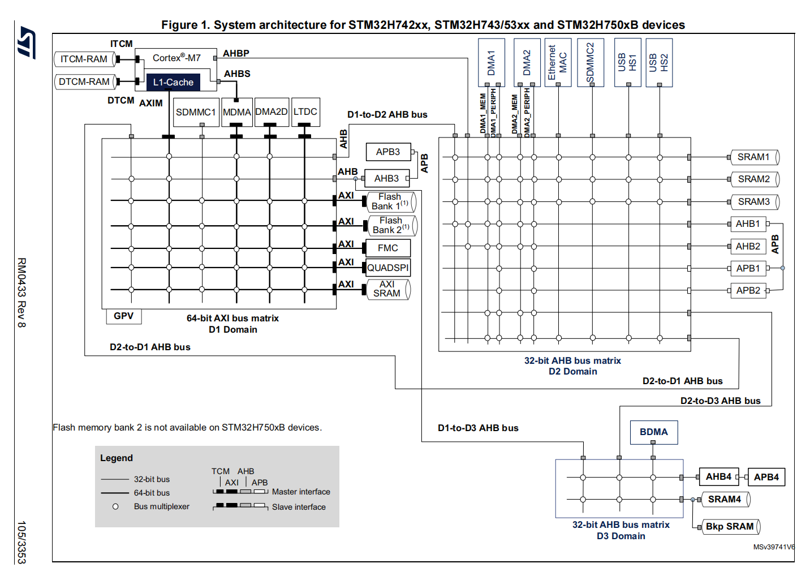
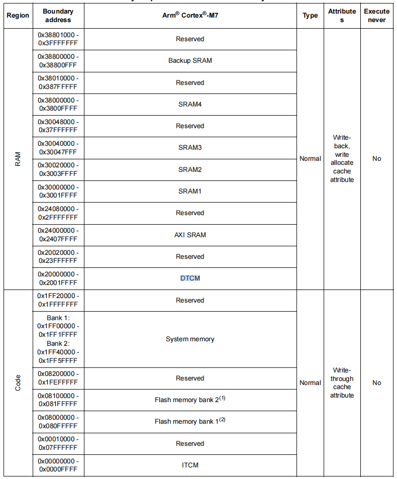
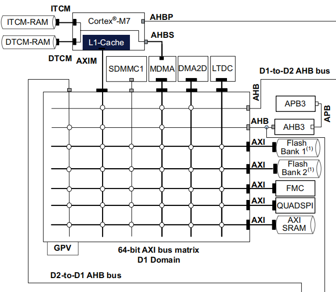
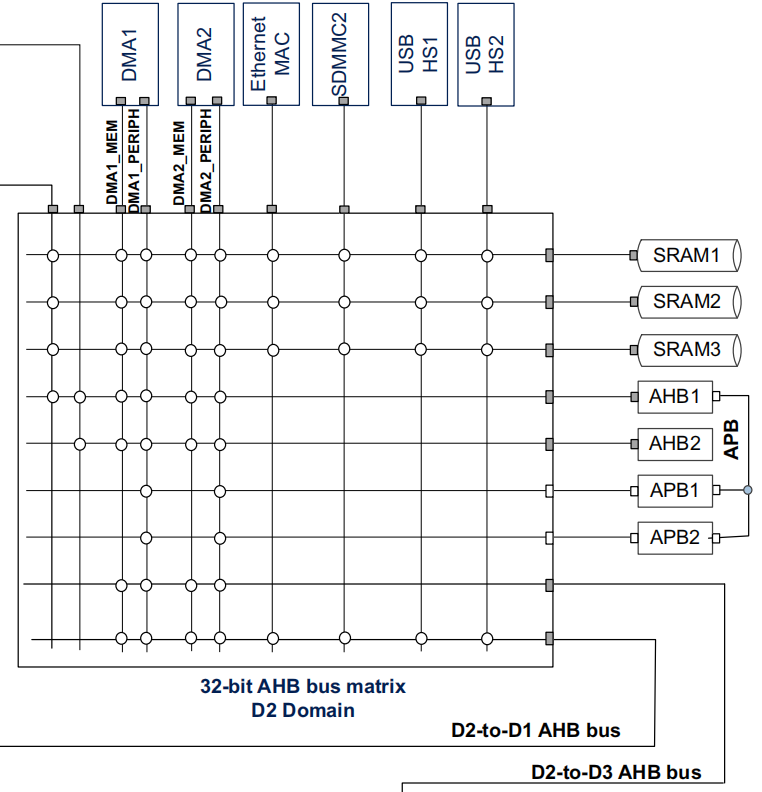

# Memory and bus architecture
## System architecture

> 系统结构总共分为三个域:D1,D2,D3。图中细实线代表32bit bus粗的代表64bit bus，上边的代表Master外设，右边的代表Slave外设。
```text
D1 Domain：高性能核心域
D2 Domain：主要外设和 DMA 域
D3 Domain：系统控制、低功耗和备份域
```
---
## memory map

## D1域

### ITCM-RAM 和 DTCM-RAM
### TCM-RAM
ITCM 全称：
```text
Instruction Tightly Coupled Memory
```
即指令紧耦合存储器。
主要用途：
```text
放关键代码
放中断服务函数
放实时性要求高的函数
```
特点：
```text
靠近 Cortex-M7
访问速度快
延迟确定
主要用于代码执行
```
---
## DTCM-RAM
DTCM 全称：
```text
Data Tightly Coupled Memory
```
即数据紧耦合存储器。
主要用途：
```text
放栈
放堆
放 CPU 频繁访问的变量
放实时控制数据
```
特点：
```text
靠近 Cortex-M7
访问速度快
延迟确定
适合 CPU 访问
不适合普通 DMA buffer
```
---

### 为什么 DMA buffer 不建议放 DTCM？
因为普通 DMA1 / DMA2 通常不能直接访问 ITCM / DTCM。
所以如果你这样定义：

```c
uint8_t sd_dma_buffer[512];
```
而链接脚本把它放到了 DTCM，例如地址在：
```text
0x20000000 附近
```
那么 DMA 可能无法正常访问这个 buffer。
更推荐：
```text
SDMMC DMA buffer → SRAM1 / SRAM2
USB / Ethernet buffer → SRAM3
BDMA buffer → SRAM4
```
---
### Flash Bank1 / Bank2 笔记

### 什么是Flash Bank

STM32H743 内部 Flash 可以分成两个区域：

```text
Flash Bank1
Flash Bank2
```

可以简单理解为：

```text
Bank1 = Flash 前半部分
Bank2 = Flash 后半部分
```

Bank 的主要作用是方便：

```text
程序存储
Flash 擦除和写入管理
Bootloader / IAP 升级
双固件备份
Bank swap 启动切换
```

---

## STM32H743 Flash 的基本结构

典型结构：

```text
Main Flash memory
├── Bank1
│   ├── Sector 0
│   ├── Sector 1
│   ├── ...
│   └── Sector n
│
└── Bank2
    ├── Sector 0
    ├── Sector 1
    ├── ...
    └── Sector n
```

其中：

```text
Bank 是 Flash 的大分区
Sector 是 Flash 的擦除单位
```

---
## Sector 是什么？

Sector 是 Flash 的擦除单位。

在 STM32H743 中，sector 通常为：

```text
1 个 sector = 128 KB
```

也就是说，Flash 不能像 RAM 一样随便按字节擦除。

如果要擦除 Flash，通常至少要擦除一个 sector。

---

## 2 MB Flash 型号的 Sector 示例

对于 2 MB Flash 型号：

```text
Bank1：1 MB，共 8 个 sector
Bank2：1 MB，共 8 个 sector
```

Bank1：

```text
Sector 0：0x0800 0000 - 0x0801 FFFF
Sector 1：0x0802 0000 - 0x0803 FFFF
Sector 2：0x0804 0000 - 0x0805 FFFF
Sector 3：0x0806 0000 - 0x0807 FFFF
Sector 4：0x0808 0000 - 0x0809 FFFF
Sector 5：0x080A 0000 - 0x080B FFFF
Sector 6：0x080C 0000 - 0x080D FFFF
Sector 7：0x080E 0000 - 0x080F FFFF
```

Bank2：

```text
Sector 0：0x0810 0000 - 0x0811 FFFF
Sector 1：0x0812 0000 - 0x0813 FFFF
Sector 2：0x0814 0000 - 0x0815 FFFF
Sector 3：0x0816 0000 - 0x0817 FFFF
Sector 4：0x0818 0000 - 0x0819 FFFF
Sector 5：0x081A 0000 - 0x081B FFFF
Sector 6：0x081C 0000 - 0x081D FFFF
Sector 7：0x081E 0000 - 0x081F FFFF
```

---

## Bank1 和 Bank2 的常见用途

### 普通程序存储

默认情况下，程序通常从 Bank1 开始运行：

```text
程序起始地址：0x0800 0000
```
一般包括：

```text
中断向量表
.text 代码段
.rodata 只读数据
常量
初始化数据
```
---

### 7.2 Bootloader + Application

常见分区方式：

```text
Bank1：Bootloader
Bank2：Application
```
例如：

```text
0x0800 0000：Bootloader
0x0810 0000：User Application
```
Bootloader 启动后，可以判断是否跳转到 Bank2 中的应用程序。

---

### 双固件升级

也可以这样设计：

```text
Bank1：当前正在运行的固件
Bank2：新下载的固件
```
升级流程示例：

```text
1. 当前程序在 Bank1 中运行
2. 通过串口 / USB / SD 卡 / 网络下载新固件
3. 将新固件写入 Bank2
4. 校验 Bank2 中的新固件
5. 校验通过后切换启动地址或跳转到 Bank2
6. Bank2 中的新程序开始运行
```
这种方式的优点是：

```text
升级过程中不会直接破坏原程序
升级失败时仍然可以回退到旧程序
适合做可靠的 IAP / OTA 升级
```
---

### 固件备份

还可以这样使用：

```text
Bank1：主程序
Bank2：备份程序
```

如果 Bank1 程序损坏，可以尝试从 Bank2 启动。

---

## Bank Swap 是什么？

Bank swap 指的是交换 Bank1 和 Bank2 在地址空间中的映射关系。

正常情况下：

```text
0x0800 0000 → Bank1
0x0810 0000 → Bank2
```

Bank swap 后可以理解为：

```text
0x0800 0000 → Bank2
0x0810 0000 → Bank1
```

这个功能常用于双 Bank 固件升级。

例如：

```text
升级前：
0x0800 0000 → 旧固件
0x0810 0000 → 新固件

Bank swap 后：
0x0800 0000 → 新固件
0x0810 0000 → 旧固件
```

这样系统复位后可以从新固件启动。

---

## Bank1 和 Bank2 的寄存器区别

STM32H743 中 Bank1 和 Bank2 有各自对应的 Flash 控制寄存器和状态寄存器。

常见寄存器：

```text
FLASH_CR1   ：Bank1 控制寄存器
FLASH_SR1   ：Bank1 状态寄存器
FLASH_CCR1  ：Bank1 清除寄存器

FLASH_CR2   ：Bank2 控制寄存器
FLASH_SR2   ：Bank2 状态寄存器
FLASH_CCR2  ：Bank2 清除寄存器
```

也就是说：

```text
操作 Bank1 时，要关注带 1 的寄存器
操作 Bank2 时，要关注带 2 的寄存器
```

---

## Flash 擦除时为什么要区分 Bank？

Flash 擦除通常有两种方式：

```text
Sector erase：擦除某个 sector
Bank erase：擦除整个 bank
```

如果要擦除 Bank1，需要操作 Bank1 对应控制位。

如果要擦除 Bank2，需要操作 Bank2 对应控制位。

简单理解：

```text
擦 Bank1 → 操作 FLASH_CR1 相关位
擦 Bank2 → 操作 FLASH_CR2 相关位
```

---

## Flash 写入和擦除的注意事项

Flash 与 RAM 不同，不能随意覆盖写入。

一般规律：

```text
Flash 擦除后，bit 变为 1
Flash 编程时，只能把 bit 从 1 写成 0
如果要把 0 重新变成 1，必须先擦除
```

因此写 Flash 时通常流程是：

```text
1. 解锁 Flash
2. 擦除目标 sector
3. 写入数据
4. 校验数据
5. 加锁 Flash
```
---

## 简单代码示例：Bootloader 跳转到 Bank2

假设应用程序放在 Bank2：

```text
APP_ADDRESS = 0x0810 0000
```

跳转代码示例：

```c
#include "stm32h7xx.h"

#define APP_ADDRESS  0x08100000U

typedef void (*pFunction)(void);

void JumpToApplication(void)
{
    uint32_t app_stack;
    uint32_t app_reset_handler;
    pFunction app_entry;

    app_stack = *(volatile uint32_t *)APP_ADDRESS;
    app_reset_handler = *(volatile uint32_t *)(APP_ADDRESS + 4U);

    __disable_irq();

    SCB->VTOR = APP_ADDRESS;

    __set_MSP(app_stack);

    app_entry = (pFunction)app_reset_handler;
    app_entry();
}
```

说明：

```text
APP_ADDRESS 处存放应用程序的初始栈指针
APP_ADDRESS + 4 处存放应用程序的 Reset_Handler 地址
跳转前需要设置 VTOR，让中断向量表指向新的应用程序
```

---

## Bank1 / Bank2 总结

| 项目 | Bank1 | Bank2 |
|---|---|---|
| 典型起始地址 | 0x0800 0000 | 0x0810 0000 |
| 默认用途 | 默认启动程序区域 | 第二程序区 / 升级区 |
| 是否常用于 Bootloader | 是 | 一般用于 Application |
| 是否可用于固件备份 | 可以 | 可以 |
| 是否涉及 Bank swap | 可以 | 可以 |
| 控制寄存器 | FLASH_CR1 / SR1 / CCR1 | FLASH_CR2 / SR2 / CCR2 |

---
# FMC 与 LTDC 

## FMC 是什么？

**FMC = Flexible Memory Controller**

中文可理解为：

```text
灵活存储控制器
```

它的作用是让 STM32 外接并访问并行接口存储器。

常见外接器件：

```text
外部 SRAM
外部 SDRAM
外部 NOR Flash
外部 NAND Flash
PSRAM
```

简单理解：

```text
FMC = STM32 访问外部存储器的控制器
```

典型数据路径：

```text
Cortex-M7
   ↓
AXI 总线
   ↓
FMC
   ↓
外部 SDRAM / SRAM / Flash
```

---

## LTDC 是什么？

**LTDC = LCD-TFT Display Controller**

中文可理解为：

```text
LCD-TFT 显示控制器
```

它的作用是驱动 RGB 接口的 TFT LCD 屏幕。

常见 LCD 信号：

```text
RGB 数据线
HSYNC
VSYNC
DE
PCLK
```

简单理解：

```text
LTDC = 从内存读取图像数据，并输出到 LCD 屏幕
```

典型数据路径：

```text
Framebuffer
     ↓
   LTDC
     ↓
 LCD 屏幕
```

---

## FMC 和 LTDC 的关系

LCD 显示通常需要一块较大的 framebuffer。

例如：

```text
480 × 272 × 2 Byte ≈ 255 KB
800 × 480 × 2 Byte ≈ 750 KB
```

如果内部 RAM 不够，常见做法是：

```text
用 FMC 外接 SDRAM
把 framebuffer 放在外部 SDRAM
LTDC 从 SDRAM 读取图像数据
再输出到 LCD
```

数据路径：

```text
外部 SDRAM
    ↑
   FMC
    ↑
AXI 总线
    ↓
   LTDC
    ↓
 LCD 屏幕
```

---

## FMC与LTDC总结

```text
FMC 负责连接外部存储器。
LTDC 负责把内存中的图像显示到 LCD 屏幕。
```

更形象地说：

```text
FMC：帮 STM32 接外部 SDRAM / SRAM / Flash
LTDC：帮 STM32 驱动 LCD 显示屏
```

---
# AHBP / AHBS / MDMA 

## 总体关系

在 STM32H743 中，Cortex-M7 并不是只通过一条总线访问所有资源，而是有多条接口：

```text
Cortex-M7
 ├── AXIM  → 访问 D1 域高速资源
 ├── AHBP  → 访问 D2 域外设
 ├── ITCM  → 访问 ITCM-RAM
 ├── DTCM  → 访问 DTCM-RAM
 └── AHBS  ← 允许 MDMA 访问 ITCM / DTCM
```

简单记忆：

```text
AHBP：CPU 去访问外设
AHBS：别人来访问 CPU 旁边的 TCM
MDMA：高级 DMA，可以搬运大块数据，也能访问 TCM
```

---

## AHBP 是什么？

AHBP 可以理解为：

```text
AHB Peripheral Bus
```

它是 Cortex-M7 用来访问 D2 域外设的一条 AHB 总线接口。

---

## AHBP 的作用

Cortex-M7 通过 AHBP 访问 D2 域中的：

```text
AHB1 外设
AHB2 外设
APB1 外设
APB2 外设
```

例如：

```text
DMA1 / DMA2
SPI2 / SPI3
USART2 / USART3
I2C1 / I2C2
TIM2 / TIM3
USB
Ethernet
SDMMC2
```

---

## AHBP 访问路径

```text
Cortex-M7
   ↓
AHBP
   ↓
D2 AHB bus matrix
   ↓
AHB1 / AHB2 / APB1 / APB2 外设
```

例如 CPU 配置 SPI2：

```text
CPU → AHBP → D2 AHB bus matrix → AHB/APB Bridge → APB1 → SPI2
```

---

## AHBP 总结

```text
AHBP 是 CPU 主动访问外设的通路。
```

也就是说：

```text
CPU 是 master
外设寄存器是 slave
```

---

# AHBS 是什么？

AHBS 可以理解为：

```text
AHB Slave Bus
```

这里的重点是：

```text
Slave
```

它不是 CPU 用来访问外设的总线，而是让其他 master 访问 Cortex-M7 旁边的 TCM。

---

## AHBS 的作用

AHBS 主要用于：

```text
允许 MDMA 访问 ITCM-RAM 和 DTCM-RAM
```

访问路径：

```text
MDMA
  ↓
AHBS
  ↓
ITCM / DTCM
```

---

##  AHBS 总结

```text
AHBS 是给 MDMA 访问 TCM 用的。
```

也就是说：

```text
MDMA 是 master
ITCM / DTCM 是被访问的目标
```

---

# AHBP 和 AHBS 对比

| 名称 | 含义 | 方向 | 主动访问者 | 主要作用 |
|---|---|---|---|---|
| AHBP | AHB Peripheral Bus | CPU → 外设 | Cortex-M7 | CPU 访问 D2 域外设 |
| AHBS | AHB Slave Bus | MDMA → TCM | MDMA | MDMA 访问 ITCM / DTCM |

简单记法：

```text
AHBP：CPU 去访问外设
AHBS：MDMA 来访问 TCM
```

---

# MDMA 是什么？


MDMA 可以理解为：

```text
Master Direct Memory Access
```

它是 STM32H7 中的高级 DMA 控制器。

相比 DMA1 / DMA2，MDMA 更适合：

```text
大块数据搬运
内存到内存搬运
跨存储区域搬运
复杂搬运
访问 ITCM / DTCM
```

---

## MDMA 的两条重要访问路径

MDMA 有两类重要访问通路：

```text
路径 1：MDMA → AXI bus matrix → AXI SRAM / Flash / FMC / QSPI / 外设

路径 2：MDMA → AHBS → ITCM / DTCM
```

---

## MDMA 可以做什么？

MDMA 常用于：

```text
DTCM ↔ AXI SRAM
DTCM ↔ SRAM1 / SRAM2
AXI SRAM ↔ 外部 SDRAM
内部 SRAM ↔ 外部存储器
大块内存搬运
数据重排
数据宽度转换
```

---
# D2域

```
最右边加粗的APB标识是AHB到APB的桥接器信号，AHB是高速信号总线，但是有一些外设不需要高速的时钟信号，但是挂在AHB上浪费资源，所以搞了个支路APB来连接低速外设
```
##  AHB与APB

```text
AHB 是系统中的高速主干总线；
APB 是挂在 AHB 后面的低速外设总线；
AHB/APB Bridge 是 AHB 和 APB 之间的协议转换桥。
```
---

##  AHB
AHB 全称：

```text
Advanced High-performance Bus
```

在 STM32H743 中，AHB 主要用于连接较高速的资源，例如：

```text
SRAM
DMA
GPIO
USB
Ethernet
SDMMC2
AHB1 / AHB2 / AHB3 / AHB4 外设
跨域总线 D1-to-D2 / D2-to-D1 / D1-to-D3 / D2-to-D3
```

AHB 的特点：

```text
速度较高
结构比 APB 复杂
适合数据搬运
适合 DMA 访问
适合连接 SRAM 和高速外设
```

---

## APB

APB 全称：

```text
Advanced Peripheral Bus
```

APB 主要用于连接普通低速外设的寄存器，例如：

```text
SPI
USART / UART
I2C
TIM
PWR
RTC
LPUART
部分系统控制外设
```

APB 的特点：

```text
结构简单
速度相对较低
功耗较低
主要用于外设寄存器访问
一般不作为高速数据搬运主通道
```

---

## AHB和APB的核心关系

APB 通常不是直接接到 CPU 上，而是通过 AHB/APB Bridge 接到 AHB 系统中。

典型结构：

```text
CPU / DMA / 其他 bus master
        ↓
AXI / AHB 总线系统
        ↓
AHB/APB Bridge
        ↓
APB1 / APB2 / APB3 / APB4
        ↓
SPI / USART / I2C / TIM 等 APB 外设
```

所以：

```text
APB 外设虽然挂在 APB 上，
但 CPU 或 DMA 要访问它时，前面通常仍然要经过 AHB 或 AXI/AHB 总线系统。
```

---

## AHB/APB Bridge

AHB 和 APB 是不同的总线协议，不能简单用导线直接相连。

AHB/APB Bridge 的作用是：

```text
把 AHB 访问请求转换成 APB 访问请求；
把 APB 外设返回的数据再送回 AHB；
完成数据宽度、时序、控制信号的转换。
```

简单理解：

```text
AHB/APB Bridge = AHB 和 APB 之间的协议转换器
```

---

## APB 的分布

STM32H743 中常见 APB 总线有：

```text
APB1
APB2
APB3
APB4
```

大致归属：

```text
APB1 / APB2：主要在 D2 域
APB3：主要在 D1 域
APB4：主要在 D3 域
```

---

## AHB 的分布

常见 AHB 总线有：

```text
AHB1
AHB2
AHB3
AHB4
```

大致归属：

```text
AHB3：D1 域相关
AHB1 / AHB2：D2 域相关
AHB4：D3 域相关
```

此外还有跨域 AHB bus：

```text
D1-to-D2 AHB bus
D2-to-D1 AHB bus
D1-to-D3 AHB bus
D2-to-D3 AHB bus
```

这些跨域 AHB bus 用来让一个域中的 master 访问另一个域中的 slave。

---

## CPU访问APB外设的路径

1. 访问 APB1 / APB2 外设

APB1 / APB2 多在 D2 域。

例如 CPU 访问 SPI2、USART2、I2C1、TIM2 等 APB1 外设时，路径大致是：

```text
Cortex-M7
   ↓
AHBP
   ↓
D2 AHB bus matrix
   ↓
AHB/APB Bridge
   ↓
APB1
   ↓
SPI2 / USART2 / I2C1 / TIM2 寄存器
```

例如：

```c
SPI2->CR1 = value;
```

本质上是：

```text
CPU 通过总线系统访问 APB1 上 SPI2 的控制寄存器。
```

---

2. 访问 APB3 / APB4 外设

APB3 和 APB4 不在 D2 域。

CPU 访问 APB3 / APB4 外设时，大致路径是：

```text
Cortex-M7
   ↓
AXIM
   ↓
D1 AXI bus matrix
   ↓
AHB/APB Bridge 或跨域 AHB bus
   ↓
APB3 / APB4
   ↓
对应外设寄存器
```

所以不能简单说：

```text
CPU 访问所有 APB 外设都走 AHBP
```

更准确是：

```text
APB1 / APB2 多通过 AHBP 到 D2 域；
APB3 / APB4 多通过 AXIM / D1 总线系统和相关桥接访问。
```

## DMA 访问 APB 外设的路径

以 DMA1 给 SPI2 发送数据为例：

```text
SRAM1 / SRAM2
     ↓
DMA1
     ↓
D2 AHB bus matrix
     ↓
AHB/APB Bridge
     ↓
APB1
     ↓
SPI2 数据寄存器
```

这里的角色是：

```text
DMA1 = bus master，主动发起访问
SPI2 = APB slave，被访问的外设寄存器
```

注意：

```text
SPI2 自己通常不会主动去 SRAM 中取数据；
真正搬运数据的是 DMA。
```

---

## AHB 外设和 APB 外设的区别

| 类型 | 特点 | 典型外设 |
|---|---|---|
| AHB 外设 | 更高速，更靠近主干总线 | GPIO、DMA、USB、Ethernet、SDMMC2、部分系统资源 |
| APB 外设 | 较低速，主要是寄存器型外设 | SPI、USART、I2C、TIM、PWR、RTC |

注意：

```text
GPIO 在 STM32H743 中通常挂在 AHB4 上，不是 APB 外设。
```

---

## AHB / APB 和 RCC 时钟的关系

外设挂在哪条总线上，通常也决定了它的时钟使能寄存器在哪一类 RCC 寄存器里。

常见形式：

```text
RCC_AHBxENR   ：使能 AHB 外设时钟
RCC_APBxENR   ：使能 APB 外设时钟
```

例如：

```c
__HAL_RCC_GPIOA_CLK_ENABLE();   // GPIOA 通常在 AHB4

__HAL_RCC_SPI2_CLK_ENABLE();    // SPI2 通常在 APB1

__HAL_RCC_USART1_CLK_ENABLE();  // USART1 通常在 APB2

__HAL_RCC_PWR_CLK_ENABLE();     // PWR 通常在 APB4
```

所以：

```text
使用外设前，必须先打开对应总线上的外设时钟。
```

---

## 寄存器地址和总线的关系

每个外设都有一个基地址。

例如：

```text
GPIOA 有 GPIOA 的基地址
SPI2 有 SPI2 的基地址
USART1 有 USART1 的基地址
RCC 有 RCC 的基地址
```

访问某个寄存器的本质是：

```text
寄存器地址 = 外设基地址 + 寄存器偏移
```

例如：

```c
SPI2->CR1 = value;
```

本质上是：

```text
CPU 向 SPI2 基地址 + CR1 偏移处写入数据。
```

如果 SPI2 挂在 APB1 上，那么这次访问会经过：

```text
CPU → 总线系统 → AHB/APB Bridge → APB1 → SPI2
```

---

## AHB/APB 和 DMA 的实际意义

如果使用普通外设 DMA，例如：

```text
SPI DMA
UART DMA
I2C DMA
ADC DMA
```

需要理解：

```text
DMA 是 master；
SRAM 是 memory slave；
外设数据寄存器是 peripheral slave；
如果外设在 APB 上，中间要经过 AHB/APB Bridge。
```

例如 SPI DMA 发送：

```text
SRAM
 ↓
DMA
 ↓
AHB bus matrix
 ↓
AHB/APB Bridge
 ↓
APB
 ↓
SPI 数据寄存器
```

例如 SPI DMA 接收：

```text
SPI 数据寄存器
 ↓
APB
 ↓
AHB/APB Bridge
 ↓
DMA
 ↓
SRAM
```

---

## AHB/APB 与 D1 / D2 / D3 域的关系

STM32H743 分为 D1、D2、D3 三个域。

可以粗略理解为：

```text
D1：高性能核心域
D2：主要外设和 DMA 域
D3：系统控制、低功耗和备份域
```

对应总线大致为：

```text
D1：
    AXI bus matrix
    AHB3
    APB3

D2：
    32-bit AHB bus matrix
    AHB1
    AHB2
    APB1
    APB2

D3：
    32-bit AHB bus matrix
    AHB4
    APB4
```

跨域访问通过跨域 AHB bus 完成：

```text
D1-to-D2 AHB
D2-to-D1 AHB
D1-to-D3 AHB
D2-to-D3 AHB
```

---
